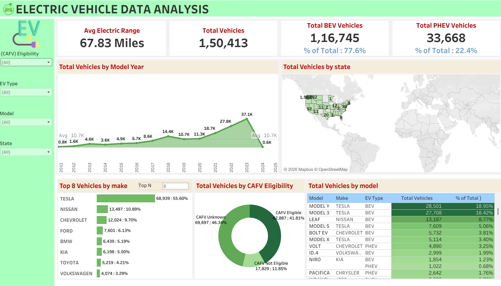

# ⚡ Electric Vehicle Population Data Analysis — Tableau Dashboard


An interactive Tableau dashboard exploring EV adoption trends, manufacturer dominance, geographic distribution, and clean fuel eligibility across the United States.

---

## Dashboard Preview



---

## 🔗 Live Dashboard

👉 **View on Tableau Public**

---

## 📌 Project Overview

This project analyzes the **Washington State Electric Vehicle Population Dataset** from Data.gov, transforming **150,000+ vehicle registration records** into a comprehensive, interactive Tableau dashboard.

The goal is to uncover actionable insights about:

* EV market trends
* Manufacturer performance
* Regional adoption patterns

---

## 📊 Dashboard Features

| Visual                      | Description                                             |
| --------------------------- | ------------------------------------------------------- |
| 📈 KPI Scorecards           | Total EVs, Avg. Electric Range, Total BEVs, Total PHEVs |
| 📅 EV Growth by Model Year  | Area chart showing year-over-year adoption growth       |
| 🗺️ Geographic Distribution | State-level map of EV concentration                     |
| 🏆 Top 10 Makes             | Bar chart of leading EV manufacturers                   |
| 🍩 BEV vs PHEV Split        | Donut chart showing vehicle type distribution           |
| ✅ CAFV Eligibility          | Clean fuel incentive eligibility breakdown              |
| 🚗 Top 10 Models            | Most popular EV models in the dataset                   |

💡 *All visuals support cross-filtering — click any chart element to dynamically filter the entire dashboard.*

---

## 🔍 Key Insights

* Tesla dominates with **Model Y** and **Model 3** as the top registered vehicles
* BEVs significantly outnumber PHEVs, indicating a shift toward fully electric vehicles
* Peak adoption year: **2023**, with rapid growth since 2016
* Average electric range: **~67.83 miles**
* **King County, WA** has the highest EV concentration
* Many vehicles have unknown or ineligible CAFV status, suggesting policy gaps

---

## 🗂️ Repository Structure

```
ev-population-analysis/
│
├── EV.twb                        # Tableau workbook file
├── README.md                     # Project documentation
├── EV_Analysis_Report.pdf        # Full analytical report
├── dashboard_screenshot.png      # Dashboard preview image
└── Electric_Vehicle_Population_Data.csv  # Dataset (optional/local)
```

---

## 🛠️ Tools & Technologies

* **Tableau Desktop / Tableau Public** — Dashboard design & publishing
* **Washington State DOL Dataset** — Source data (CSV)
* **Calculated Fields** — Custom KPIs
* **Sets & Filters** — Top-N analysis
* **Dashboard Actions** — Interactive cross-filtering

---

## 📁 Dataset

| Property   | Value                                                                                  |
| ---------- | -------------------------------------------------------------------------------------- |
| Source     | Data.gov — Electric Vehicle Population Data                                            |
| Provider   | Washington State Department of Licensing                                               |
| Records    | 150,422+ vehicles                                                                      |
| Coverage   | BEV & PHEV vehicles                                                                    |
| Key Fields | VIN, County, State, Model Year, Make, Model, EV Type, CAFV Eligibility, Electric Range |

---

## 🚀 How to Open the Workbook

1. Download **Tableau Desktop** or **Tableau Public (free)**
2. Clone this repository:

   ```bash
   git clone https://github.com/YOUR_USERNAME/ev-population-analysis.git
   ```
3. Open `EV.twb` in Tableau
4. Reconnect the dataset if prompted

👉 Or simply view the live dashboard on Tableau Public

---

## 📄 Report

The repository includes a detailed report (`EV_Analysis_Report.pdf`) covering:

* Executive Summary
* Dataset Overview
* Dashboard Breakdown
* Key Findings
* Policy Recommendations
* Conclusion

---

## 👩‍💻 Author

**Minna Nourin**

---

⭐ *If you found this project helpful, consider starring the repository!*
